# ⚡ 7-Flash Delivery - Retail OS

> **⚡ Premium Retail Management & Rapid Storefront Client**
>
> * **🚀 Live Production Storefront:** [https://7-flash-delivery.vercel.app/shop](https://7-flash-delivery.vercel.app/shop)
> * **🔌 Live Backend API Production:** [https://seven-flash-delivery.onrender.com](https://seven-flash-delivery.onrender.com)
> * **📖 Interactive API Docs (Swagger):** [https://seven-flash-delivery.onrender.com/swagger-ui/index.html](https://seven-flash-delivery.onrender.com/swagger-ui/index.html)
>
> ---
>
> ### 💡 Quick Testing & Experience Guide (For Reviewers / Recruiters)
> You can experience all premium features of the system instantly without any friction:
> 1. **No Registration Required (Simulated Guest/Admin - Recruiter Mode):** 
>    * You can navigate directly to the [Product Management](https://7-flash-delivery.vercel.app/admin/products) or [Order Management](https://7-flash-delivery.vercel.app/admin/orders) dashboards. The system will automatically authenticate a simulated Admin account, allowing you to test all CRUD capabilities, view inventory analytics, securely upload images to Cloudinary, and update order statuses.
>    * On the shopping storefront, you can freely browse products, add items to the cart, and proceed to checkout as a guest customer (login is not mandatory).
> 2. **Flexible New Account Registration:**
>    * You can register a new account on the Sign Up page and select either the **Khách hàng (USER)** or **Quản trị viên (ADMIN)** role to inspect the system's strict role-based security filters and access controls.

Welcome to **7-Flash Delivery (Retail OS)** — a premium retail management and rapid delivery storefront integrated with an automated payment gateway. This system is designed as a modular monolith following **Domain-Driven Design (DDD)** and **Clean Architecture** principles to showcase high-concurrency backend stability, event-driven communications, and sleek responsive frontend user experiences.

---

## 🏛️ System Architecture & Sequence Flow

The project separates logic into clean, domain-focused modules (`user`, `product`, `order`). To facilitate future microservices migration, the PostgreSQL database is separated into three isolated schemas:
* `user_schema`: Handles authentication, user profiles, and JWT security.
* `product_schema`: Manages inventory levels (POS Stock), catalogs, and caching.
* `order_schema`: Manages order lifecycles and transactions.

### Asynchronous Order Placement & Payment Flow
This sequence diagram illustrates the decoupled stock reservation, Redis mapping, and real-time PayOS status polling:

```mermaid
%%{init: { 'theme': 'dark', 'themeVariables': { 'actorBorder': '#10b981', 'actorBkg': '#0D1F17', 'actorTextColor': '#ffffff', 'rectBorderColor': '#F58220', 'rectBkgColor': '#1e293b', 'lineColor': '#10b981', 'signalColor': '#F58220', 'signalTextColor': '#ffffff', 'labelBoxBorderColor': '#10b981', 'labelBoxBkgColor': '#0D1F17', 'labelTextColor': '#ffffff' } } }%%
sequenceDiagram
    autonumber
    actor User as Customer
    participant FE as React Frontend
    participant BE as Spring Boot Backend
    participant Redis as Redis Cache
    participant DB as PostgreSQL DB
    participant PayOS as PayOS Gateway

    User->>FE: Click "Xác nhận Đặt hàng" (Place Order)
    FE->>BE: POST /api/orders (Create Order)
    Note over BE: Initialize order as PENDING
    BE->>DB: Save PENDING order to Database
    BE-->>FE: Return orderId (UUID)
    
    rect rgb(30, 41, 59)
        Note over BE, DB: ASYNCHRONOUS INVENTORY CHECK
        BE->>BE: Publish InventoryDeductEvent (Async)
        BE->>DB: findByIdWithPessimisticWriteLock (Lock row)
        alt Stock Available
            BE->>DB: Deduct stock & Evict Redis Cache
        else Out of Stock
            BE->>DB: Update order status to CANCELLED
        end
    end

    FE->>BE: POST /api/payments/create/{orderId}
    BE->>Redis: Save bi-directional mapping (UUID <-> orderCode)
    BE->>PayOS: Request Checkout Link (payOS.create)
    PayOS-->>BE: Return checkoutUrl
    BE-->>FE: Return URL & Render Embedded QR Iframe

    rect rgb(30, 41, 59)
        Note over FE, BE: STATE POLLING LOOP
        FE->>BE: GET /api/orders/{orderId}/status (Every 1.5s)
        BE->>Redis: Retrieve orderCode from UUID
        BE->>PayOS: Query Payment Details (payOS.get)
        PayOS-->>BE: Return status (PAID / CANCELLED / PENDING)
        alt Status is PAID
            BE->>DB: Update order status to CONFIRMED
            BE->>BE: Publish OrderConfirmedEvent (RabbitMQ Bridge)
        else Status is CANCELLED
            BE->>DB: Trigger InventoryRestoreEvent (Compensation) & Cancel Order
        end
        BE-->>FE: Return current order status
    end

    alt Status transitions to CONFIRMED
        FE-->>User: Close modal, Clear cart & Show success popup!
    end
```



---

## 🛠️ Technology Stack

Below is a structured overview of the technologies, databases, brokers, and testing frameworks used in the project:

| Component / Layer | Technologies & Tools |
| --- | --- |
| **Backend Core** | Java 17, Spring Boot 3.2.x (Spring Data JPA, Spring Security, Spring Web MVC) |
| **Frontend Core** | React 18, Vite, JavaScript (ES6+), HTML5, Vanilla CSS, TailwindCSS |
| **Database & Cache** | PostgreSQL (Neon Cloud Database), Redis (Upstash In-Memory Database & Cache) |
| **Message Broker** | RabbitMQ (CloudAMQP Broker & Event Broadcasting Bridge) |
| **Unit Testing & Mocking** | JUnit 5, Mockito, Spring Boot Starter Test |
| **API Documentation** | Swagger UI, OpenAPI 3 |
| **Build Tools & Libraries** | Maven, Lombok, MapStruct |

---

## 🚀 Core Backend System Features

The backend architecture is designed to solve real-world transaction management, concurrency, and caching requirements:

### 1. Asynchronous POS Stock Reservation
Instead of executing slow database writes on the main thread during checkout, the system uses an asynchronous event-driven design. 
* Placing an order triggers a Spring `InventoryDeductEvent`, which is processed asynchronously by the `InventoryEventListener`.
* To completely eliminate **Race Conditions** and **Overselling** (POS stock conflicts) under high concurrent traffic, we enforce a Pessimistic Write Lock (`PESSIMISTIC_WRITE`) when querying products for reservation, forcing concurrent threads to queue up cleanly.

### 2. High-Speed Caching & Temporary Data Mappings with Redis
**Why Redis?** It is used as a low-latency, in-memory data store for both active caching and temporary state mapping.
* **JSR310 LocalDateTime Compatibility:** We configured a custom `RedisTemplate` with a customized Jackson `ObjectMapper` registering the `JavaTimeModule`. This prevents standard serialization crashes on Java 8 date/time types.
* **Bi-directional Transaction Lookup:** PayOS enforces a strict 64-bit `Long` value for `orderCode`, but our system utilizes standard 128-bit `UUID`s. Redis elegantly bridges this gap without relational database changes by storing high-speed transient maps:
  - `payos:ordercode:{longCode} -> {UUID}`
  - `payos:uuid:{UUID} -> {longCode}` (with a 24-hour expiration).

### 3. Asynchronous Event Bridging with RabbitMQ
**Why RabbitMQ?** It serves as our reliable message broker to decouple external systems and downstream notification pipelines.
* When a payment transitions to `CONFIRMED`, `RabbitMQInventoryBridge.java` catches the event and publishes a JSON payload to RabbitMQ exchanges. This ensures that notifying delivery partners or triggering email alerts never blocks the core database transactional thread.

### 4. Compensation-Based Transaction Flow (Saga Pattern Light)
Payment and stock deduction states are decoupled to protect merchant inventory:
* Successful stock deduction reserves the items but leaves the order in a `PENDING` payment state.
* The backend polls PayOS dynamically during frontend requests. If the transaction expires or is cancelled on PayOS, the backend automatically triggers an `InventoryRestoreEvent` (Compensation Transaction) to restore POS stock levels, evict Redis caches, and update the order state to `CANCELLED`.

### 5. Robust Unit & Transactional Mock Testing
The backend is backed by an extensive test suite in `ProductServiceTest` using **JUnit 5** and **Mockito**.
* We isolate and mock dependencies such as `ProductRepository` and `CacheManager` to verify correct behavior under diverse scenarios, including transactional rollbacks, duplicate key creation, and cache eviction validation.

---

## 👨‍💻 Local Setup & Running Guide

### Prerequisites
* **Docker & Docker Compose** installed.
* **Java 17 (JDK)** and **Node.js (v18+)** installed.

### Step 1: Start Infrastructure Containers
Launch Dockerized Redis and RabbitMQ instantly:
```bash
docker compose up -d
```
*(Ensure ports `6379` for Redis and `5672`/`15672` for RabbitMQ are free).*

### Step 2: Run Spring Boot Backend
1. Move to the `backend` directory and duplicate the env template:
   ```bash
   cd backend
   cp .env.example .env
   ```
2. Open `.env` and fill in your database details and PayOS API Credentials.
3. Build and run the backend:
   ```bash
   mvn clean spring-boot:run
   ```
   *(Backend will start on port `8080`)*.

### Step 3: Run React Frontend
1. Open a new terminal and move to the `frontend` directory:
   ```bash
   cd frontend
   npm install
   ```
2. Start the Vite dev server:
   ```bash
   npm run dev
   ```
3. Open your browser and navigate to: [http://localhost:3000](http://localhost:3000).

---

## 🔍 Recruitment Review & Testing Walkthrough

1. **Physical Flying Cart UX:** Visit [https://7-flash-delivery.vercel.app/shop](https://7-flash-delivery.vercel.app/shop) (or local `localhost:3000/shop`). Add a product and observe the physical flying thumbnail Bezier-curve animation, ending with a physical bounce (`.cart-bump`) of the header cart icon.
2. **Real Payment Integration:** Click the Cart, input a note, and click **"Xác nhận đặt hàng"**. Scan the generated VietQR QR code inside the embedded Iframe to pay (via real gateway or sandbox environment). The storefront polls status and automatically clears the cart upon success.
3. **Demo Bypass Fast-Track:** If PayOS credentials are empty, the backend returns a clean `400 Bad Request` catching the SDK failure. The frontend falls back to a warning and displays a prominent orange **"Thanh toán ngay (Demo - Không quét mã)"** button. Clicking this instantly updates the order to `CONFIRMED` without any bank transactions!
4. **Admin Dashboard Portal:** Click **"Quản lý"** in the storefront header (hidden for normal registered customers, visible for guests and admins) to enter the Retail OS Dashboard, where you can modify POS Stock levels and track incoming orders.
