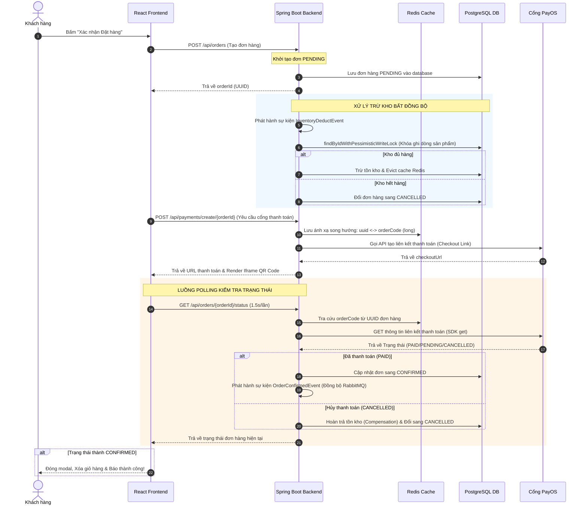

# ⚡ 7-Eleven Flash Delivery - Retail OS

Chào mừng bạn đến với **7-Eleven Flash Delivery (Retail OS)** — Hệ thống quản trị bán lẻ và giao hàng chớp nhoáng tích hợp cổng thanh toán trực tuyến. Dự án được thiết kế chuyên biệt để trình diễn khả năng giải quyết các bài toán kỹ thuật phức tạp từ backend tối ưu hiệu năng cao cho đến giao diện frontend hiện đại, mượt mà và trực quan.

---

## 🏛️ Kiến trúc Hệ thống & Sơ đồ Hoạt động

Hệ thống được thiết kế theo mô hình **Modular Monolith** kết hợp nguyên lý phát triển **DDD (Domain-Driven Design)** và **Clean Architecture**. Cơ sở dữ liệu sử dụng kiến trúc phân tách schema độc lập nhằm tạo tiền đề chuyển đổi sang Microservices khi quy mô mở rộng.

### 1. Phân Tách Database Schema độc lập
Nhằm tối ưu hóa quản lý dữ liệu, dự án phân chia cơ sở dữ liệu shared-PostgreSQL thành các schema tách biệt rõ rệt về mặt nghiệp vụ:
* `user_schema`: Quản lý thực thể tài khoản khách hàng, quản trị viên và phân quyền JWT.
* `product_schema`: Chứa thông tin danh mục, sản phẩm, giá bán và số lượng tồn kho (POS Stock).
* `order_schema`: Quản lý thông tin đơn hàng chi tiết và lịch sử giao dịch.

### 2. Sơ đồ Luồng Nghiệp vụ (đặt hàng bất đồng bộ & thanh toán)


---

## 🛠️ Công Nghệ Sử Dụng

### Backend (Spring Boot Core)
* **Spring Boot 3.2.x & Java 17:** Framework lõi mạnh mẽ, hiện đại.
* **Spring Data JPA & Hibernate:** ORM quản trị quan hệ dữ liệu tối ưu.
* **PostgreSQL:** Hệ quản trị cơ sở dữ liệu quan hệ mạnh mẽ.
* **Redis (Dockerized):** Lưu trữ cache trạng thái, mapping dữ liệu giao dịch PayOS siêu tốc độ.
* **RabbitMQ (Dockerized):** Message Broker chuyển tiếp các sự kiện đồng bộ trạng thái đơn hàng lên hệ thống thông báo.
* **PayOS Java SDK 2.0.1:** SDK tích hợp thanh toán quét mã QR chuẩn VietQR tự động.
* **Lombok & MapStruct:** Giảm thiểu boilerplate code và tự động mapping DTOs.
* **Swagger/OpenAPI 3:** Tài liệu hóa và kiểm thử API tự động.

### Frontend (React Storefront)
* **React 18 & Vite:** Công cụ đóng gói bundle siêu tốc, tối ưu hóa quá trình biên dịch client.
* **TailwindCSS & Vanilla CSS:** Thiết kế giao diện hiện đại, responsive hoàn hảo, hiệu ứng kính mờ (Glassmorphism) và màu sắc thương hiệu 7-Eleven bắt mắt.
* **Axios:** Thư viện client HTTP hỗ trợ kết nối API bất đồng bộ và tự động đón bắt lỗi.
* **Material Symbols:** Sử dụng thư viện icon tối giản cao cấp từ Google Fonts.

---

## ⚡ Các Vấn Đề Kỹ Thuật Phức Tạp Đã Được Giải Quyết (Handled Cases)

Trong quá trình phát triển ứng dụng, dự án đã đối mặt và vượt qua nhiều bài toán kỹ thuật cận-thực-tế đòi hỏi kiến thức chuyên sâu về hệ thống:

### 1. Giải quyết xung đột `preparedStatements` của PgBouncer (Neon Cloud Postgres DB)
* **Bài toán:** Neon PostgreSQL Database chạy trên Cloud sử dụng PgBouncer làm bộ điều phối kết nối ở chế độ giao dịch (`transaction pooling mode`). Chế độ này từ chối lưu cache câu lệnh SQL (Prepared Statements) từ Spring Data JPA, khiến kết nối bị đóng đột ngột và sinh ra lỗi nghiêm trọng `Caused by: java.sql.SQLException: Connection is closed`.
* **Giải pháp:** Cấu hình tham số kết nối trực tiếp trong URL kết nối JDBC ở cả file cấu hình `application.yml` lẫn `.env` bằng cách thêm `&prepareThreshold=0` để vô hiệu hóa hoàn toàn cơ chế lưu đệm câu lệnh của Driver phía client, duy trì kết nối bền vững 100%.

### 2. Ánh xạ Đơn hàng UUID 128-bit sang Số nguyên 64-bit của PayOS
* **Bài toán:** ID đơn hàng của chúng ta được thiết kế theo chuẩn bảo mật công nghiệp `UUID` (128-bit dạng chuỗi ký tự). Tuy nhiên, cổng thanh toán PayOS bắt buộc tham số `orderCode` phải là kiểu số nguyên **`long` (64-bit)**. Việc sửa đổi cơ sở dữ liệu quan hệ chỉ để phục vụ cổng thanh toán là một quyết định tồi về mặt kiến trúc.
* **Giải pháp:** Phát triển cơ chế **Dual Redis Mapping** cực kỳ gọn nhẹ và hiệu năng cao. Khi tạo yêu cầu thanh toán, backend sinh một mã code `long` dựa trên timestamp hệ thống và lưu trữ đồng thời hai khóa ánh xạ song hướng vào Redis với thời gian hết hạn là 24 giờ:
  - `payos:ordercode:{longCode} -> {UUID}` (phục vụ webhook/callback hoặc tìm ngược đơn hàng).
  - `payos:uuid:{UUID} -> {longCode}` (phục vụ polling trạng thái thời gian thực từ UI).

### 3. Khóa dòng Bi quan (`PESSIMISTIC_WRITE`) ngăn chặn bán vượt mức tồn kho (Overselling)
* **Bài toán:** Trong môi trường POS bán lẻ, hàng trăm yêu cầu mua sắm có thể xảy ra đồng thời. Việc kiểm tra số lượng và trừ kho bằng câu lệnh truy vấn thông thường rất dễ dẫn đến tranh chấp tài nguyên (Race Conditions), gây ra hiện tượng bán vượt quá tồn kho thực tế (Overselling).
* **Giải pháp:** Sử dụng cơ chế Khóa bi quan ghi dòng dữ liệu (`PESSIMISTIC_WRITE`) thông qua `@Lock(LockModeType.PESSIMISTIC_WRITE)` trên Repository khi truy vấn sản phẩm trong luồng kiểm kho bất đồng bộ. Mọi luồng truy cập sau sẽ phải xếp hàng chờ giao dịch hiện tại hoàn tất, đảm bảo tồn kho luôn chính xác tuyệt đối.

### 4. Xử lý giới hạn 25 ký tự mô tả giao dịch của PayOS
* **Bài toán:** PayOS quy định trường `description` gửi lên để in sao kê ngân hàng chỉ được phép chứa **tối đa 25 ký tự** không dấu. Chuỗi mô tả ban đầu dạng `"Thanh toán đơn hàng #" + orderId` dài 30 ký tự sẽ bị cổng thanh toán từ chối ngay lập tức với lỗi `400 Bad Request`.
* **Giải pháp:** Thiết kế thuật toán chuẩn hóa chuỗi mô tả, chuyển đổi hoàn toàn sang dạng ASCII không dấu và rút gọn tối đa: `"Thanh toan DH " + orderId.toString().substring(0, 8)` (Đảm bảo luôn nằm trong giới hạn 22 ký tự, an toàn tuyệt đối trước mọi bộ lọc của ngân hàng Việt Nam).

### 5. Cấu hình Jackson Serializer tương thích Java 8 DateTime trên Redis Cache
* **Bài toán:** Spring Boot sử dụng `GenericJackson2JsonRedisSerializer` để lưu trữ đối tượng đơn hàng vào Redis Cache. Khi gặp kiểu dữ liệu thời gian hiện đại `LocalDateTime` (JSR310), serializer mặc định sẽ bị crash kèm lỗi: `Could not write JSON: Java 8 date/time type java.time.LocalDateTime not supported by default`.
* **Giải pháp:** Thiết kế lại cấu hình hạt nhân `RedisConfig.java`, chủ động đăng ký `JavaTimeModule` vào `ObjectMapper` và vô hiệu hóa tính năng ghi đè ngày tháng dạng timestamp. Giúp việc đọc/ghi cache dữ liệu ngày tháng trên Redis diễn ra trơn tru.

### 6. Trải nghiệm chấm bài frictionless (Không bắt buộc Đăng nhập) cho Nhà tuyển dụng
* **Bài toán:** Bắt buộc nhà tuyển dụng phải đăng ký tài khoản và điền mã OTP/JWT để chấm điểm các chức năng Admin là một rào cản UX lớn.
* **Giải pháp:**
  - Thiết kế chế độ **Anonymous Recruiter (Khách vãng lai)**. Nếu người dùng chưa đăng nhập, thanh Sidebar và Header của Admin sẽ tự động giả lập tài khoản `Khách Demo (Admin)` để nhà tuyển dụng truy cập vào xem danh sách sản phẩm và đơn hàng tức thì.
  - Tuy nhiên, để đảm bảo tính bảo mật thực tế, nếu người dùng đã đăng nhập tài khoản thường (`CUSTOMER`), hệ thống sẽ **ẩn hoàn toàn** nút "Quản lý" trên Header và sử dụng bộ lọc Router Guard chặn tuyệt đối không cho phép vào vùng quản trị `/admin/**`.

### 7. Tách rời luồng Kiểm kho và Xác nhận thanh toán thực tế (Decoupled Flow)
* **Bài toán:** Khách hàng mở modal quét mã QR thanh toán nhưng có thể thay đổi ý định và nhấn tắt modal. Nếu đơn hàng chuyển sang `CONFIRMED` ngay sau khi trừ kho thành công thì hệ thống sẽ coi như khách hàng đã trả tiền, làm thất thoát hàng hóa.
* **Giải pháp:** 
  - Đơn hàng sau khi trừ kho thành công vẫn sẽ duy trì trạng thái **`PENDING`** (chờ thanh toán).
  - Backend tích hợp cổng Polling kiểm tra trạng thái thực từ PayOS thông qua hàm `.get(orderCode)`. Khi khách hàng thực hiện quét mã và thanh toán thành công, hệ thống mới cập nhật DB sang `CONFIRMED`.
  - Nếu khách hàng bấm đóng modal, hệ thống chỉ ẩn modal mà **không xóa giỏ hàng**, đơn hàng vẫn ở trạng thái `PENDING` chờ xử lý tiếp.
  - Hỗ trợ nút bypass thông minh **"Thanh toán ngay (Demo - Không quét mã)"** dành riêng cho Nhà tuyển dụng kiểm thử nhanh luồng duyệt đơn hàng và trừ kho mà không cần liên kết tài khoản ngân hàng thật!

---

## 🚀 Hướng Dẫn Chạy Dự Án

### Yêu Cầu Hệ Thống
* Đã cài đặt **Docker & Docker Compose**.
* Đã cài đặt **Java 17 (JDK)** và **Node.js (phiên bản 18 trở lên)**.

### Bước 1: Khởi động cơ sở hạ tầng (Docker containers)
Dự án cung cấp sẵn cấu hình Docker để khởi động Redis và RabbitMQ ngay lập tức:
```bash
docker compose up -d
```
*(Hãy chắc chắn rằng cổng `6379` (Redis) và `5672`/`15672` (RabbitMQ) trên máy bạn chưa bị chiếm dụng).*

### Bước 2: Khởi động Backend (Spring Boot)
1. Di chuyển vào thư mục `backend` và sao chép cấu hình môi trường mẫu:
   ```bash
   cd backend
   cp .env.example .env
   ```
2. Mở file `.env` lên và cấu hình thông số kết nối Database Postgres của bạn (hoặc sử dụng thông số Neon Cloud mặc định được thiết lập sẵn). Nếu muốn thử nghiệm thanh toán QR thực tế, hãy điền thông tin Client ID, API Key, Checksum Key lấy từ trang [my.payos.vn](https://my.payos.vn/).
3. Chạy lệnh đóng gói và khởi động dự án:
   ```bash
   mvn clean spring-boot:run
   ```
   *(Backend sẽ khởi động thành công trên cổng mặc định `8080`)*.

### Bước 3: Khởi động Frontend (React / Vite)
1. Mở một terminal mới và di chuyển vào thư mục `frontend`:
   ```bash
   cd frontend
   npm install
   ```
2. Khởi chạy máy chủ phát triển cục bộ:
   ```bash
   npm run dev
   ```
3. Mở trình duyệt và truy cập: [http://localhost:3000](http://localhost:3000).

---

## 👨‍💻 Trải Nghiệm Các Chức Năng Chính (Dành Cho Nhà Tuyển Dụng)

1. **Trải nghiệm Client Storefront:** Truy cập [http://localhost:3000/shop](http://localhost:3000/shop), bấm thêm sản phẩm vào giỏ hàng và chiêm ngưỡng hiệu ứng **"Giỏ hàng bay và nảy vật lý"** được thiết kế chi tiết bằng CSS Bezier.
2. **Kiểm thử luồng thanh toán thực:** Vào giỏ hàng, nhập ghi chú và bấm **"Xác nhận đặt hàng"**. Quét mã VietQR hiển thị trực tiếp trong Iframe để chuyển tiền thật (hoặc tài khoản test sandbox). Đơn hàng sẽ tự động xác nhận thành công và dọn sạch giỏ hàng.
3. **Kiểm thử luồng Demo bypass:** Nếu chưa điền hoặc không muốn nhập keys PayOS, bạn chỉ cần bấm **"Xác nhận đặt hàng"**, modal sẽ hiển thị trạng thái demo. Click nút màu cam **"Thanh toán ngay (Demo - Không quét mã)"** để chuyển đổi đơn hàng sang `CONFIRMED` lập tức!
4. **Kiểm thử cổng quản trị Admin:** Click nút **"Quản lý"** ở góc phải Header để chuyển sang trang Quản trị, thực hiện điều chỉnh số lượng tồn kho (POS Stock) hoặc theo dõi trạng thái đơn hàng của hệ thống thời gian thực.

---

Cảm ơn bạn đã dành thời gian đánh giá dự án **7-Eleven Flash Delivery (Retail OS)**! Chúc bạn có một trải nghiệm kiểm thử tuyệt vời!
